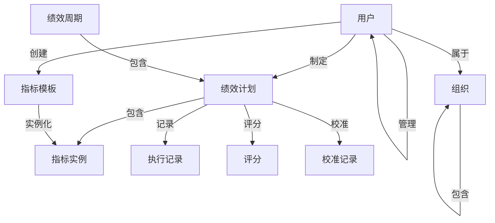

# 领域模型设计

## 1. 领域模型概述

### 1.1 核心领域
绩效管理系统包含以下核心领域：
- **组织域**：组织架构、部门、岗位
- **用户域**：员工、角色、权限
- **绩效域**：绩效周期、计划、指标、评估
- **分析域**：数据统计、报表、AI 分析

### 1.2 领域驱动设计原则
- **聚合根**：PerformancePlan、User、Org
- **实体**：Indicator、Score、Record
- **值对象**：Weight、ScoreValue
- **领域服务**：ScoreCalculationService、CalibrationService

---

## 2. 核心领域模型

### 2.1 组织域（Organization Domain）

#### Org（组织）
```java
/**
 * 组织实体 - 聚合根
 */
public class Org {
    private Long id;                    // 组织ID
    private String name;                // 组织名称
    private Long parentId;              // 父组织ID
    private Integer level;              // 组织层级
    private Long leaderId;              // 负责人ID
    private String code;                // 组织编码
    private Integer sort;               // 排序
    private Boolean enabled;            // 是否启用
    private LocalDateTime createdAt;
    private LocalDateTime updatedAt;
    
    // 领域行为
    public void addChild(Org child);
    public void setLeader(User leader);
    public List<Org> getChildren();
}
```

**业务规则**：
- 组织树深度不超过 10 层
- 删除组织前需检查是否有子组织或员工
- 组织变更需记录审计日志

---

### 2.2 用户域（User Domain）

#### User（用户）
```java
/**
 * 用户实体 - 聚合根
 */
public class User {
    private Long id;                    // 用户ID
    private String username;            // 用户名
    private String password;            // 密码（加密）
    private String employeeNo;          // 工号
    private String name;                // 姓名
    private String email;               // 邮箱
    private String phone;               // 手机号
    private Long orgId;                 // 所属组织ID
    private Long positionId;            // 岗位ID
    private Long managerId;             // 直属上级ID
    private String role;                // 角色（EMPLOYEE/MANAGER/HR/ADMIN）
    private UserStatus status;          // 状态
    private LocalDateTime lastLoginAt;  // 最后登录时间
    private LocalDateTime createdAt;
    private LocalDateTime updatedAt;
    
    // 领域行为
    public boolean isManager();
    public boolean isHr();
    public List<User> getSubordinates();
    public void changePassword(String oldPwd, String newPwd);
}

public enum UserStatus {
    ACTIVE,         // 正常
    INACTIVE,       // 禁用
    LOCKED          // 锁定
}
```

#### Role（角色）
```java
public class Role {
    private Long id;
    private String code;                // 角色编码
    private String name;                // 角色名称
    private String description;         // 描述
    private List<Permission> permissions; // 权限列表
}
```

#### Permission（权限）
```java
public class Permission {
    private Long id;
    private String code;                // 权限编码
    private String name;                // 权限名称
    private ResourceType type;          // 资源类型
    private String resource;            // 资源标识
}

public enum ResourceType {
    MENU,           // 菜单
    BUTTON,         // 按钮
    DATA            // 数据
}
```

---

### 2.3 绩效域（Performance Domain）

#### PerformanceCycle（绩效周期）
```java
/**
 * 绩效周期 - 聚合根
 */
public class PerformanceCycle {
    private Long id;
    private String name;                // 周期名称（如：2026年Q1）
    private CycleType type;             // 周期类型
    private LocalDate startDate;        // 开始日期
    private LocalDate endDate;          // 结束日期
    private CycleStatus status;         // 状态
    private Long createdBy;             // 创建人
    private LocalDateTime createdAt;
    private LocalDateTime updatedAt;
    
    // 领域行为
    public void start();
    public void end();
    public boolean isInProgress();
    public long getDurationDays();
}

public enum CycleType {
    QUARTERLY,      // 季度
    ANNUAL,         // 年度
    MONTHLY         // 月度
}

public enum CycleStatus {
    NOT_STARTED,    // 未开始
    IN_PROGRESS,    // 进行中
    EVALUATING,     // 评估中
    COMPLETED       // 已完成
}
```

**业务规则**：
- 同一时间只能有一个进行中的周期
- 周期结束后自动进入评估阶段
- 周期不可删除，只能归档

---

#### PerformancePlan（绩效计划）
```java
/**
 * 绩效计划 - 聚合根
 */
public class PerformancePlan {
    private Long id;
    private Long userId;                // 员工ID
    private Long cycleId;               // 周期ID
    private Long orgId;                 // 组织ID
    private PlanStatus status;          // 状态
    private BigDecimal totalScore;      // 总分
    private PerformanceLevel finalLevel; // 最终等级
    private String comment;             // 评语
    private Long evaluatorId;           // 评估人ID
    private LocalDateTime submittedAt;  // 提交时间
    private LocalDateTime evaluatedAt;  // 评估时间
    private LocalDateTime calibratedAt; // 校准时间
    private LocalDateTime createdAt;
    private LocalDateTime updatedAt;
    
    // 关联对象
    private List<IndicatorInstance> indicators; // 指标实例列表
    private List<PerformanceRecord> records;    // 执行记录
    private List<Score> scores;                 // 评分列表
    
    // 领域行为
    public void submit();
    public void approve();
    public void reject(String reason);
    public void calculateTotalScore();
    public void assignEvaluator(Long evaluatorId);
    public boolean canSubmit();
    public boolean canEvaluate();
}

public enum PlanStatus {
    DRAFT,              // 草稿
    PENDING_SUBMIT,     // 待提交
    PENDING_APPROVE,    // 待审批
    IN_PROGRESS,        // 执行中
    PENDING_EVAL,       // 待评估
    EVALUATED,          // 已评估
    CALIBRATED,         // 已校准
    ARCHIVED            // 已归档
}

public enum PerformanceLevel {
    A,  // 优秀 (90-100)
    B,  // 良好 (80-89)
    C,  // 合格 (70-79)
    D   // 待改进 (<70)
}
```

**状态流转规则**：
```
DRAFT → PENDING_SUBMIT → PENDING_APPROVE → IN_PROGRESS 
→ PENDING_EVAL → EVALUATED → CALIBRATED → ARCHIVED
```

---

#### Indicator（指标模板）
```java
/**
 * 指标模板 - 实体
 */
public class Indicator {
    private Long id;
    private String name;                // 指标名称
    private IndicatorType type;         // 指标类型
    private IndicatorCategory category; // 指标分类
    private String description;         // 描述
    private String calculationRule;     // 计算规则
    private CalculationType calcType;   // 计算方式
    private DataSource dataSource;      // 数据来源
    private Long parentId;              // 父指标ID
    private Boolean enabled;            // 是否启用
    private LocalDateTime createdAt;
    private LocalDateTime updatedAt;
    
    // 领域行为
    public boolean isKPI();
    public boolean isOKR();
    public List<Indicator> getChildren();
}

public enum IndicatorType {
    KPI,            // 关键绩效指标
    OKR,            // 目标与关键结果
    BSC             // 平衡计分卡
}

public enum IndicatorCategory {
    FINANCIAL,      // 财务
    CUSTOMER,       // 客户
    INTERNAL,       // 内部流程
    LEARNING        // 学习与成长
}

public enum CalculationType {
    AUTO,           // 自动计算
    MANUAL          // 手动评分
}

public enum DataSource {
    API,            // API 接口
    MES,            // MES 系统
    ERP,            // ERP 系统
    MANUAL          // 手动录入
}
```

---

#### IndicatorInstance（指标实例）
```java
/**
 * 指标实例 - 实体
 * 解决"同一个指标不同人不同目标值"的问题
 */
public class IndicatorInstance {
    private Long id;
    private Long indicatorId;           // 指标模板ID
    private Long planId;                // 绩效计划ID
    private Long ownerId;               // 责任人ID
    private String name;                // 指标名称（冗余）
    private IndicatorType type;         // 指标类型（冗余）
    private BigDecimal weight;          // 权重（0-100）
    private BigDecimal targetValue;     // 目标值
    private BigDecimal currentValue;    // 当前值
    private BigDecimal progress;        // 进度百分比
    private InstanceStatus status;      // 状态
    private String unit;                // 单位
    private String remark;              // 备注
    
    // 领域行为
    public void updateProgress(BigDecimal value);
    public void calculateProgress();
    public BigDecimal getScore();
    public boolean isCompleted();
}

public enum InstanceStatus {
    NOT_STARTED,    // 未开始
    IN_PROGRESS,    // 进行中
    COMPLETED,      // 已完成
    DELAYED         // 延期
}
```

**业务规则**：
- 同一计划下所有指标权重之和 = 100%
- 进度更新需记录历史
- 自动计算的指标从外部系统同步

---

#### PerformanceRecord（绩效记录）
```java
/**
 * 绩效执行记录 - 实体
 */
public class PerformanceRecord {
    private Long id;
    private Long planId;                // 绩效计划ID
    private Long userId;                // 员工ID
    private RecordType type;            // 记录类型
    private String content;             // 内容
    private BigDecimal progress;        // 进度
    private List<String> attachments;   // 附件URL列表
    private LocalDate recordDate;       // 记录日期
    private Long createdBy;             // 创建人
    private LocalDateTime createdAt;
    
    // AI 增强字段
    private String aiSummary;           // AI 总结
    private List<String> aiSuggestions; // AI 建议
}

public enum RecordType {
    WEEKLY_REPORT,      // 周报
    MONTHLY_REPORT,     // 月报
    MILESTONE,          // 里程碑
    ACHIEVEMENT         // 成果记录
}
```

---

#### Score（评分）
```java
/**
 * 绩效评分 - 实体
 */
public class Score {
    private Long id;
    private Long planId;                // 绩效计划ID
    private Long evaluatorId;           // 评估人ID
    private ScoreType scoreType;        // 评分类型
    private BigDecimal scoreValue;      // 分数
    private String comment;             // 评语
    private List<DimensionScore> dimensions; // 维度评分
    private LocalDateTime createdAt;
    private LocalDateTime updatedAt;
    
    // 领域行为
    public boolean isSelfEvaluation();
    public boolean isManagerEvaluation();
    public BigDecimal getWeightedScore();
}

public enum ScoreType {
    SELF,               // 自评
    MANAGER,            // 上级评价
    PEER,               // 同事评价（360）
    SUBORDINATE,        // 下级评价（360）
    AUTO                // 自动评分
}

/**
 * 维度评分 - 值对象
 */
public class DimensionScore {
    private String dimension;           // 维度名称
    private BigDecimal weight;          // 权重
    private BigDecimal score;           // 分数
    private String comment;             // 评语
}
```

**评分模型**：
```
最终得分 = Σ(维度得分 × 维度权重)
综合得分 = 自评×10% + 上级×60% + 同事×20% + 下级×10%
```

---

#### Calibration（绩效校准）
```java
/**
 * 绩效校准记录 - 实体
 */
public class Calibration {
    private Long id;
    private Long cycleId;               // 周期ID
    private Long orgId;                 // 组织ID
    private Long planId;                // 绩效计划ID
    private BigDecimal beforeScore;     // 校准前分数
    private BigDecimal afterScore;      // 校准后分数
    private PerformanceLevel beforeLevel; // 校准前等级
    private PerformanceLevel afterLevel;  // 校准后等级
    private String adjustReason;        // 调整原因
    private Long calibratedBy;          // 校准人
    private LocalDateTime calibratedAt; // 校准时间
}
```

**业务规则**：
- 校准需经过校准会议
- 强制分布规则（如 2-7-1 原则）
- 校准记录不可删除

---

### 2.4 分析域（Analytics Domain）

#### DashboardData（看板数据）
```java
/**
 * 绩效看板数据 - 值对象
 */
public class DashboardData {
    private Double completionRate;      // 完成率
    private Double averageScore;        // 平均分
    private Integer riskCount;          // 风险人数
    private List<DeptPerformance> deptPerformances; // 部门绩效
    private List<EmployeeRanking> topPerformers;    // Top 员工
    private TrendData trendData;        // 趋势数据
}

public class DeptPerformance {
    private Long orgId;
    private String orgName;
    private Double averageScore;
    private Integer employeeCount;
}

public class EmployeeRanking {
    private Long userId;
    private String userName;
    private Double score;
    private PerformanceLevel level;
}
```

---

## 3. 领域服务

### 3.1 ScoreCalculationService（评分计算服务）

```java
public interface ScoreCalculationService {
    /**
     * 计算指标得分
     */
    BigDecimal calculateIndicatorScore(IndicatorInstance instance);
    
    /**
     * 计算计划总分
     */
    BigDecimal calculatePlanTotalScore(PerformancePlan plan);
    
    /**
     * 计算绩效等级
     */
    PerformanceLevel calculateLevel(BigDecimal score);
    
    /**
     * 应用强制分布
     */
    void applyForcedDistribution(List<PerformancePlan> plans);
}
```

**计算逻辑**：
```java
// 指标得分计算
if (calcType == AUTO) {
    score = (currentValue / targetValue) * 100;
} else {
    score = manualScore;
}

// 计划总分
totalScore = Σ(indicatorScore * weight)

// 等级映射
if (score >= 90) return A;
if (score >= 80) return B;
if (score >= 70) return C;
return D;
```

---

### 3.2 CalibrationService（校准服务）

```java
public interface CalibrationService {
    /**
     * 执行绩效校准
     */
    void calibrate(Long cycleId, Long orgId, CalibrationRequest request);
    
    /**
     * 检查强制分布
     */
    boolean checkForcedDistribution(List<PerformancePlan> plans);
    
    /**
     * 生成校准建议
     */
    CalibrationSuggestion generateSuggestion(Long cycleId);
}
```

---

### 3.3 ProgressTrackingService（进度跟踪服务）

```java
public interface ProgressTrackingService {
    /**
     * 更新指标进度
     */
    void updateProgress(Long instanceId, BigDecimal value);
    
    /**
     * 检测风险
     */
    List<RiskAlert> detectRisks(Long planId);
    
    /**
     * 生成周报总结
     */
    String generateWeeklySummary(Long planId);
}
```

---

## 4. 领域事件

### 4.1 事件定义

```java
/**
 * 绩效计划提交事件
 */
public class PlanSubmittedEvent {
    private Long planId;
    private Long userId;
    private LocalDateTime timestamp;
}

/**
 * 绩效评估完成事件
 */
public class EvaluationCompletedEvent {
    private Long planId;
    private BigDecimal score;
    private LocalDateTime timestamp;
}

/**
 * 绩效周期结束事件
 */
public class CycleEndedEvent {
    private Long cycleId;
    private LocalDateTime timestamp;
}
```

### 4.2 事件监听器

```java
@Component
public class PerformanceEventListener {
    
    @EventListener
    public void handlePlanSubmitted(PlanSubmittedEvent event) {
        // 通知上级审批
        notificationService.notifyManager(event.getUserId());
    }
    
    @EventListener
    public void handleEvaluationCompleted(EvaluationCompletedEvent event) {
        // 触发校准流程
        calibrationService.checkCalibrationNeeded(event.getPlanId());
    }
    
    @EventListener
    public void handleCycleEnded(CycleEndedEvent event) {
        // 自动进入评估阶段
        performanceService.startEvaluation(event.getCycleId());
    }
}
```

---

## 5. 仓储接口

### 5.1 核心仓储

```java
public interface UserRepository extends JpaRepository<User, Long> {
    Optional<User> findByUsername(String username);
    Optional<User> findByEmployeeNo(String employeeNo);
    List<User> findByOrgId(Long orgId);
    List<User> findByManagerId(Long managerId);
}

public interface PerformancePlanRepository extends JpaRepository<PerformancePlan, Long> {
    List<PerformancePlan> findByUserIdAndCycleId(Long userId, Long cycleId);
    List<PerformancePlan> findByCycleIdAndOrgId(Long cycleId, Long orgId);
    List<PerformancePlan> findByStatus(PlanStatus status);
}

public interface IndicatorRepository extends JpaRepository<Indicator, Long> {
    List<Indicator> findByType(IndicatorType type);
    List<Indicator> findByParentId(Long parentId);
}
```

---

## 6. 领域模型关系图



---

## 7. 业务规则汇总

### 7.1 绩效计划规则
- 每个周期每位员工只能有一个绩效计划
- 指标权重总和必须等于 100%
- 计划提交后不可修改指标
- 评估完成后不可修改评分

### 7.2 评分规则
- 评分范围：0-100 分
- 自评必须在上级评分之前完成
- 360 评价至少需要 3 人评价
- 评分必须填写评语

### 7.3 校准规则
- 校准需符合强制分布比例
- 校准必须有调整原因
- 校准后分数不可再次修改

### 7.4 权限规则
- 员工只能查看自己的绩效
- 主管可以查看团队成员绩效
- HR 可以查看全公司绩效
- 只有 HR 和管理员可以配置指标

---

**文档版本**: V1.0  
**最后更新**: 2026-04-14  
**维护者**: 架构团队
