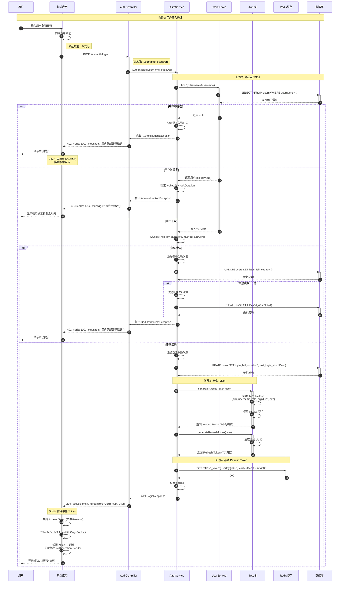
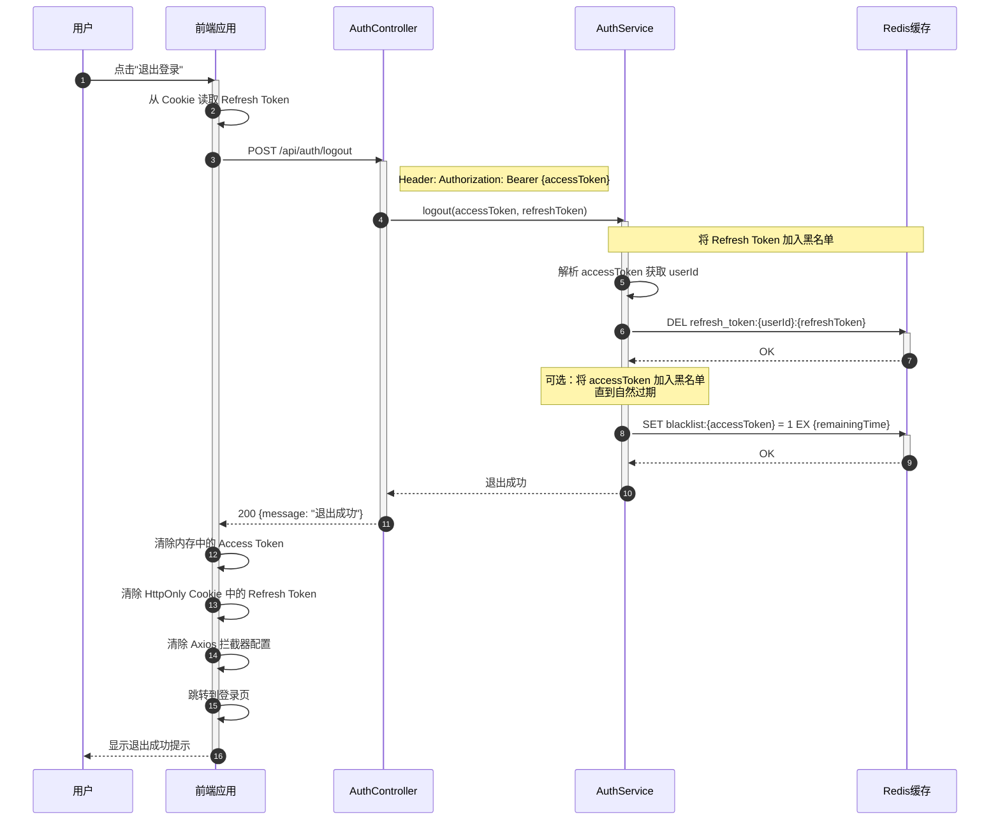

# 用户认证流程序列图

## 📋 业务场景

描述用户登录、Token 刷新和退出的完整交互流程，包括异常处理和边界情况。

## 👥 参与者定义

| 参与者 | 缩写 | 说明 |
|--------|------|------|
| 用户 | User | 系统使用者 |
| 前端应用 | FE | React 前端应用 |
| 认证控制器 | AuthController | 处理认证请求的 API 端点 |
| 认证服务 | AuthService | 认证业务逻辑 |
| 用户服务 | UserService | 用户信息查询 |
| JWT 工具 | JwtUtil | Token 生成和验证 |
| Redis 缓存 | Redis | 存储 Refresh Token 和黑名单 |
| 数据库 | DB | MySQL 用户数据 |

---

## 🔄 主流程：用户登录



---

## 🔄 异常流程：Token 刷新

```mermaid
sequenceDiagram
    autonumber
    participant FE as 前端应用
    participant AC as AuthController
    participant AS as AuthService
    participant JWT as JwtUtil
    participant Redis as Redis缓存

    Note over FE: 场景: Access Token 过期<br/>前端拦截 401 响应
    
    FE->>FE: 检测到 401 Unauthorized
    activate FE
    FE->>FE: 从 Cookie 读取 Refresh Token
    
    FE->>AC: POST /api/auth/refresh
    activate AC
    Note right of AC: 请求体: {refreshToken}
    
    AC->>AS: refreshToken(refreshToken)
    activate AS
    
    AS->>JWT: validateRefreshToken(token)
    activate JWT
    JWT->>JWT: 验证 Token 格式和签名
    
    alt Token 格式无效
        JWT-->>AS: 抛出 InvalidTokenException
        AS-->>AC: 抛出异常
        AC-->>FE: 401 {code: 1001, message: "Token 无效"}
        FE->>FE: 清除所有 Token
        FE->>FE: 跳转到登录页
    else Token 已过期
        JWT-->>AS: 抛出 ExpiredTokenException
        AS-->>AC: 抛出异常
        AC-->>FE: 401 {code: 1001, message: "Token 已过期"}
        FE->>FE: 清除所有 Token
        FE->>FE: 跳转到登录页
    else Token 有效
        JWT-->>AS: 返回 userId
        deactivate JWT
        
        Note over AS,Redis: 验证 Refresh Token 是否在 Redis 中
        AS->>Redis: GET refresh_token:{userId}:{token}
        activate Redis
        
        alt Token 不存在（已被撤销）
            Redis-->>AS: null
            deactivate Redis
            AS-->>AC: 抛出 TokenRevokedException
            AC-->>FE: 401 {code: 1001, message: "Token 已撤销"}
            FE->>FE: 跳转到登录页
        else Token 存在
            Redis-->>AS: 返回 userJson
            deactivate Redis
            
            Note over AS,JWT: 生成新的 Access Token
            AS->>JWT: generateAccessToken(user)
            activate JWT
            JWT-->>AS: 返回新 Access Token
            deactivate JWT
            
            Note over AS,Redis: 可选：轮换 Refresh Token
            AS->>AS: 生成新 Refresh Token
            AS->>Redis: DEL refresh_token:{userId}:{oldToken}
            activate Redis
            Redis-->>AS: OK
            deactivate Redis
            
            AS->>Redis: SET refresh_token:{userId}:{newToken} = userJson EX 604800
            activate Redis
            Redis-->>AS: OK
            deactivate Redis
            
            AS-->>AC: 返回 {accessToken, newRefreshToken}
            deactivate AS
            
            AC-->>FE: 200 {accessToken, refreshToken}
            deactivate AC
            
            FE->>FE: 更新 Access Token
            FE->>FE: 更新 Refresh Token Cookie
            FE->>FE: 重试原始请求
            deactivate FE
        end
    end
```

---

## 🔄 异常流程：退出登录



---

## 🔐 安全检查点

### 1. 密码安全
- ✅ 使用 BCrypt 加密存储（Rounds=12）
- ✅ 登录失败不区分"用户名错误"和"密码错误"
- ✅ 连续失败 5 次锁定账号 15 分钟

### 2. Token 安全
- ✅ Access Token 短期有效（2 小时）
- ✅ Refresh Token 长期有效但可撤销（7 天）
- ✅ Refresh Token 存储在 HttpOnly Cookie（防 XSS）
- ✅ Access Token 存储在内存（防 CSRF）
- ✅ 退出时立即撤销 Refresh Token

### 3. 传输安全
- ✅ 所有认证接口使用 HTTPS
- ✅ Password 不在 URL 中传递
- ✅ Token 通过 Authorization Header 传递

### 4. 防重放攻击
- ✅ JWT 包含 `iat`（签发时间）和 `exp`（过期时间）
- ✅ Refresh Token 使用后轮换（可选）
- ✅ 退出的 Token 加入黑名单

---

## 💡 技术实现要点

### 前端实现

**Token 存储策略**：
```typescript
// Access Token - 内存存储（Zustand）
const useAuthStore = create((set) => ({
  accessToken: null,
  setAccessToken: (token) => set({ accessToken: token }),
  clearAccessToken: () => set({ accessToken: null }),
}));

// Refresh Token - HttpOnly Cookie
// 后端设置: Set-Cookie: refreshToken=xxx; HttpOnly; Secure; SameSite=Strict
```

**Axios 拦截器**：
```typescript
// 请求拦截器 - 自动携带 Token
axios.interceptors.request.use((config) => {
  const token = useAuthStore.getState().accessToken;
  if (token) {
    config.headers.Authorization = `Bearer ${token}`;
  }
  return config;
});

// 响应拦截器 - 自动刷新 Token
axios.interceptors.response.use(
  (response) => response,
  async (error) => {
    if (error.response?.status === 401) {
      try {
        const newTokens = await refreshAccessToken();
        useAuthStore.getState().setAccessToken(newTokens.accessToken);
        // 重试原始请求
        return axios(error.config);
      } catch (refreshError) {
        // 刷新失败，跳转到登录页
        window.location.href = '/login';
      }
    }
    return Promise.reject(error);
  }
);
```

### 后端实现

**JWT 工具类**：
```java
@Component
public class JwtUtil {
    
    @Value("${jwt.secret}")
    private String secret;
    
    @Value("${jwt.access-token-expiration:7200}")
    private long accessTokenExpiration;
    
    public String generateAccessToken(User user) {
        Date now = new Date();
        Date expiryDate = new Date(now.getTime() + accessTokenExpiration * 1000);
        
        return Jwts.builder()
                .setSubject(String.valueOf(user.getId()))
                .claim("username", user.getUsername())
                .claim("role", user.getRole())
                .claim("orgId", user.getOrgId())
                .setIssuedAt(now)
                .setExpiration(expiryDate)
                .signWith(SignatureAlgorithm.HS256, secret)
                .compact();
    }
    
    public Claims validateToken(String token) {
        try {
            return Jwts.parser()
                    .setSigningKey(secret)
                    .parseClaimsJws(token)
                    .getBody();
        } catch (JwtException e) {
            throw new InvalidTokenException("Token 无效");
        }
    }
}
```

**认证过滤器**：
```java
@Component
public class JwtAuthenticationFilter extends OncePerRequestFilter {
    
    @Override
    protected void doFilterInternal(HttpServletRequest request, 
                                    HttpServletResponse response, 
                                    FilterChain filterChain) {
        String token = extractToken(request);
        
        if (token != null && jwtUtil.validateToken(token)) {
            Claims claims = jwtUtil.getClaims(token);
            
            // 检查 Token 是否在黑名单中
            if (redisTemplate.hasKey("blacklist:" + token)) {
                throw new TokenBlacklistedException("Token 已撤销");
            }
            
            Long userId = Long.parseLong(claims.getSubject());
            UserDetails userDetails = userService.loadUserById(userId);
            
            UsernamePasswordAuthenticationToken authentication = 
                new UsernamePasswordAuthenticationToken(
                    userDetails, null, userDetails.getAuthorities()
                );
            
            SecurityContextHolder.getContext().setAuthentication(authentication);
        }
        
        filterChain.doFilter(request, response);
    }
}
```

---

## 📊 性能优化建议

1. **Redis 缓存用户信息**
   - 登录成功后缓存用户信息到 Redis
   - 减少数据库查询次数
   - TTL 设置为 Access Token 有效期

2. **Token 黑名单优化**
   - 使用 Redis Set 结构存储黑名单
   - 定期清理已过期的黑名单项
   - 考虑使用 Bloom Filter 减少内存占用

3. **并发登录控制**
   - 限制同一账号最多 3 个设备同时在线
   - 新登录踢掉最旧的会话
   - 发送通知给被踢出的设备

---

## 🔗 相关文档

- [API 接口设计 - 认证授权](../../api/api-design.md#2-认证授权接口)
- [权限与安全设计](../security-design.md#2-认证机制authentication)
- [数据库设计 - 用户表](../../database/schema-design.md#221-用户表users)

---

**文档版本**: V1.0  
**最后更新**: 2026-04-14  
**维护者**: 架构团队
