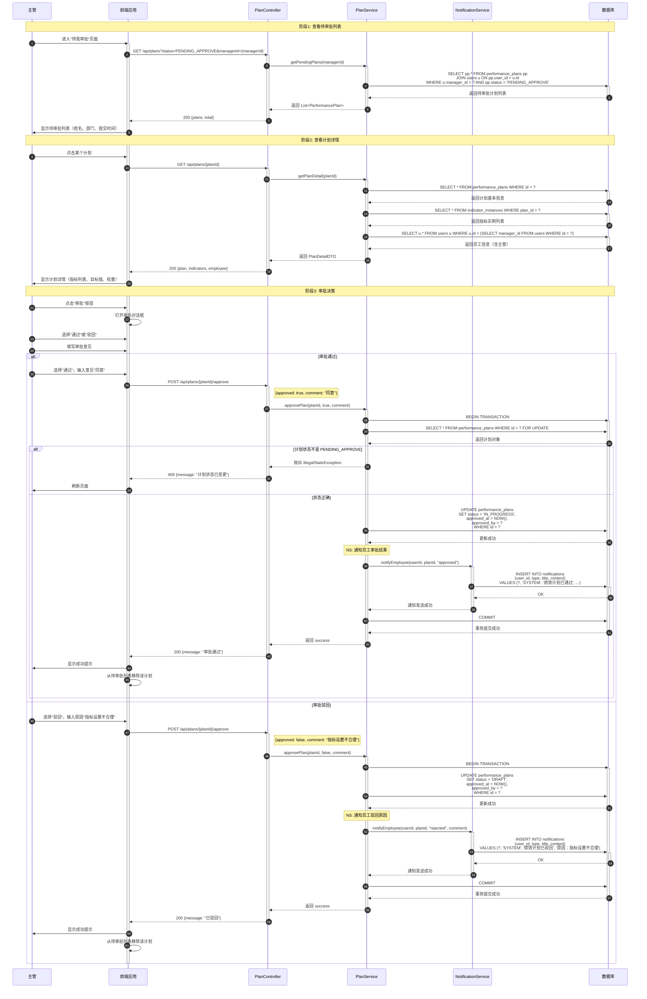

# 绩效审批流程序列图

## 📋 业务场景

描述主管审批员工提交的绩效计划，包括查看详情、审批通过/驳回、通知员工等流程。

## 👥 参与者定义

| 参与者 | 缩写 | 说明 |
|--------|------|------|
| 主管 | Manager | 审批人 |
| 前端应用 | FE | React 前端应用 |
| 计划控制器 | PlanController | API 端点 |
| 计划服务 | PlanService | 计划业务逻辑 |
| 通知服务 | NotificationService | 发送通知 |
| 数据库 | DB | MySQL |

---

## 🔄 主流程：审批通过



---

## 💡 技术实现要点

### 后端实现

**审批服务**：
```java
@Service
@Transactional
public class PlanService {
    
    public void approvePlan(Long planId, boolean approved, String comment) {
        PerformancePlan plan = planRepository.findByIdWithLock(planId)
                .orElseThrow(() -> new NotFoundException("计划不存在"));
        
        // 状态检查
        if (plan.getStatus() != PlanStatus.PENDING_APPROVE) {
            throw new IllegalStateException("只有待审批状态的计划可以审批");
        }
        
        User currentUser = SecurityUtils.getCurrentUser();
        
        if (approved) {
            // 审批通过
            plan.setStatus(PlanStatus.IN_PROGRESS);
            plan.setApprovedAt(LocalDateTime.now());
            plan.setApprovedBy(currentUser.getId());
            
            // 通知员工
            notificationService.sendSystemNotification(
                plan.getUserId(),
                "绩效计划已通过",
                "您的绩效计划已审批通过，请开始执行"
            );
        } else {
            // 审批驳回
            plan.setStatus(PlanStatus.DRAFT);
            plan.setApprovedAt(LocalDateTime.now());
            plan.setApprovedBy(currentUser.getId());
            
            // 通知员工驳回原因
            notificationService.sendSystemNotification(
                plan.getUserId(),
                "绩效计划已驳回",
                "驳回原因：" + comment
            );
        }
        
        planRepository.save(plan);
    }
}
```

---

## 🔗 相关文档

- [API 接口设计 - 绩效计划审批](../../api/api-design.md#65-审批绩效计划)
- [领域模型设计 - 状态流转](../domain-model-detail.md#34-performanceplan绩效计划)

---

**文档版本**: V1.0  
**最后更新**: 2026-04-14  
**维护者**: 架构团队
