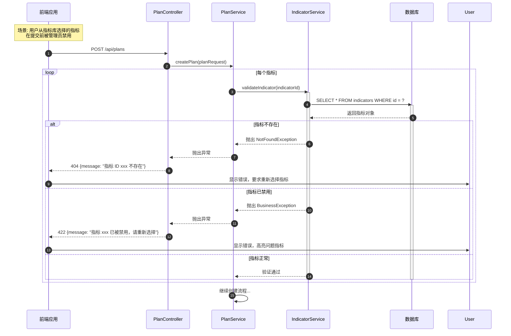

# 绩效计划创建流程序列图

## 📋 业务场景

描述员工创建绩效计划的完整流程，包括选择指标、设置目标值、权重校验、保存草稿和提交审批。

## 👥 参与者定义

| 参与者 | 缩写 | 说明 |
|--------|------|------|
| 员工 | Employee | 创建绩效计划的用户 |
| 前端应用 | FE | React 前端应用 |
| 计划控制器 | PlanController | 绩效计划 API 端点 |
| 计划服务 | PlanService | 计划业务逻辑 |
| 指标服务 | IndicatorService | 指标管理 |
| 权重校验器 | WeightValidator | 权重总和校验 |
| 通知服务 | NotificationService | 发送通知 |
| 数据库 | DB | MySQL 数据存储 |

---

## 🔄 主流程：创建并提交绩效计划

```mermaid
sequenceDiagram
    autonumber
    participant Emp as 员工
    participant FE as 前端应用
    participant PC as PlanController
    participant PS as PlanService
    participant IS as IndicatorService
    participant WV as WeightValidator
    participant NS as NotificationService
    participant DB as 数据库

    Note over Emp,DB: 阶段1: 选择绩效周期
    Emp->>FE: 进入"我的绩效"页面
    activate FE
    FE->>PC: GET /api/cycles?status=IN_PROGRESS
    activate PC
    PC->>DB: SELECT * FROM performance_cycles WHERE status = 'IN_PROGRESS'
    activate DB
    DB-->>PC: 返回当前周期列表
    deactivate DB
    PC-->>FE: 200 {cycles}
    deactivate PC
    
    FE->>Emp: 显示周期选择器
    Emp->>FE: 选择绩效周期（如 2026年Q1）
    
    Note over FE,PS: 检查是否已有该周期的计划
    FE->>PC: GET /api/plans?cycleId={cycleId}&userId={userId}
    activate PC
    PC->>PS: getPlanByUserAndCycle(userId, cycleId)
    activate PS
    PS->>DB: SELECT * FROM performance_plans WHERE user_id=? AND cycle_id=?
    activate DB
    
    alt 已存在计划
        DB-->>PS: 返回现有计划
        PS-->>PC: 返回 PerformancePlan
        PC-->>FE: 200 {plan, exists: true}
        FE->>Emp: 提示"该周期已有计划"，跳转到编辑页
    else 不存在计划
        DB-->>PS: 返回 null
        PS-->>PC: 返回 null
        PC-->>FE: 200 {plan: null, exists: false}
        FE->>Emp: 显示"创建新计划"按钮
    end
    deactivate DB
    deactivate PS
    deactivate PC
    
    Note over Emp,DB: 阶段2: 添加指标
    Emp->>FE: 点击"创建计划"
    FE->>FE: 打开计划创建向导（步骤条）
    
    Note right of FE: 步骤1: 选择指标来源
    Emp->>FE: 选择"从指标库选择"或"自定义指标"
    
    alt 从指标库选择
        FE->>PC: GET /api/indicators?type=KPI&enabled=true
        activate PC
        PC->>IS: getEnabledIndicators(type)
        activate IS
        IS->>DB: SELECT * FROM indicators WHERE enabled=1 AND type=?
        activate DB
        DB-->>IS: 返回指标列表
        deactivate DB
        IS-->>PC: 返回 List<Indicator>
        deactivate IS
        PC-->>FE: 200 {indicators}
        deactivate PC
        
        FE->>Emp: 显示指标库（可搜索、筛选）
        Emp->>FE: 勾选多个指标（如销售额、客户满意度）
        
        loop 每个选中的指标
            Emp->>FE: 设置目标值和单位
            FE->>FE: 临时存储在本地状态
        end
    else 自定义指标
        Emp->>FE: 手动输入指标信息
        Note right of FE: 表单字段：<br/>- 指标名称<br/>- 指标类型（KPI/OKR）<br/>- 权重<br/>- 目标值<br/>- 单位<br/>- 计算方式
        
        loop 每个自定义指标
            Emp->>FE: 填写指标表单
            FE->>FE: 前端验证（必填、格式）
            FE->>FE: 添加到本地列表
        end
    end
    
    Note over FE,WV: 阶段3: 权重校验
    Emp->>FE: 点击"下一步"
    FE->>WV: validateTotalWeight(indicators)
    activate WV
    WV->>WV: 计算权重总和
    Note right of WV: totalWeight = Σ(indicator.weight)
    
    alt 权重总和 != 100
        WV-->>FE: 返回 {valid: false, total: 85, message: "权重总和必须为100%"}
        FE->>Emp: 红色提示"权重总和为85%，请调整"
        FE->>FE: 禁用"下一步"按钮
        Emp->>FE: 调整各指标权重
        FE->>WV: 重新校验
        deactivate WV
    else 权重总和 = 100
        WV-->>FE: 返回 {valid: true, total: 100}
        deactivate WV
        FE->>Emp: 显示"权重校验通过"，启用"提交"按钮
    end
    
    Note over Emp,DB: 阶段4: 保存草稿
    Emp->>FE: 点击"保存草稿"
    FE->>FE: 构建请求数据
    
    Note right of FE: 请求体结构：<br/>{<br/>  userId, cycleId,<br/>  indicators: [<br/>    {indicatorId, name, type, weight, targetValue, unit},<br/>    ...<br/>  ]<br/>}
    
    FE->>PC: POST /api/plans
    activate PC
    Note right of PC: Content-Type: application/json
    
    PC->>PS: createPlan(planRequest)
    activate PS
    
    Note over PS,DB: 开启事务
    PS->>PS: @Transactional
    
    PS->>DB: INSERT INTO performance_plans (user_id, cycle_id, status, ...)
    activate DB
    Note right of DB: status = 'DRAFT'
    DB-->>PS: 返回 planId
    deactivate DB
    
    loop 每个指标
        PS->>DB: INSERT INTO indicator_instances (plan_id, indicator_id, name, weight, target_value, ...)
        activate DB
        DB-->>PS: OK
        deactivate DB
    end
    
    PS->>DB: COMMIT
    activate DB
    DB-->>PS: 事务提交成功
    deactivate DB
    
    PS-->>PC: 返回 PerformancePlan
    deactivate PS
    
    PC-->>FE: 201 {planId, status: "DRAFT"}
    deactivate PC
    
    FE->>Emp: 提示"草稿保存成功"
    FE->>FE: 跳转到计划详情页
    deactivate FE
    
    Note over Emp,DB: 阶段5: 提交审批
    Emp->>FE: 在详情页点击"提交审批"
    activate FE
    
    FE->>FE: 二次确认弹窗
    Emp->>FE: 确认提交
    
    FE->>PC: POST /api/plans/{planId}/submit
    activate PC
    
    PC->>PS: submitPlan(planId)
    activate PS
    
    Note over PS,DB: 开启事务
    PS->>PS: @Transactional
    
    PS->>DB: SELECT * FROM performance_plans WHERE id = ? FOR UPDATE
    activate DB
    Note right of DB: 行级锁，防止并发提交
    DB-->>PS: 返回计划对象
    deactivate DB
    
    alt 计划状态不是 DRAFT
        PS-->>PC: 抛出 IllegalStateException
        PC-->>FE: 409 {code: 2002, message: "计划已提交，无法重复提交"}
        FE->>Emp: 显示错误提示
    else 计划状态是 DRAFT
        Note over PS: 再次校验权重总和
        PS->>DB: SELECT SUM(weight) FROM indicator_instances WHERE plan_id = ?
        activate DB
        DB-->>PS: 返回 totalWeight
        deactivate DB
        
        alt totalWeight != 100
            PS-->>PC: 抛出 BusinessException
            PC-->>FE: 422 {message: "权重总和必须为100%"}
            FE->>Emp: 显示错误，跳转回编辑页
        else totalWeight = 100
            PS->>DB: UPDATE performance_plans SET status = 'PENDING_APPROVE', submitted_at = NOW() WHERE id = ?
            activate DB
            DB-->>PS: 更新成功（1 row affected）
            deactivate DB
            
            Note over PS:NS: 获取主管信息
            PS->>DB: SELECT manager_id FROM users WHERE id = ?
            activate DB
            DB-->>PS: 返回 managerId
            deactivate DB
            
            Note over PS:NS: 发送通知给主管
            PS->>NS: notifyManager(managerId, planId)
            activate NS
            NS->>DB: INSERT INTO notifications (user_id, type, title, content, ...)
            activate DB
            Note right of DB: type = 'APPROVAL'<br/>title = "待审批：张三的Q1绩效计划"
            DB-->>NS: OK
            deactivate DB
            NS-->>PS: 通知发送成功
            deactivate NS
            
            PS->>DB: COMMIT
            activate DB
            DB-->>PS: 事务提交成功
            deactivate DB
            
            PS-->>PC: 返回 success
            deactivate PS
            
            PC-->>FE: 200 {message: "提交成功，等待主管审批"}
            deactivate PC
            
            FE->>Emp: 显示成功提示
            FE->>FE: 更新计划状态为"待审批"
            deactivate FE
        end
    end
```

---

## 🔀 异常流程：指标被禁用或删除



---

## 💡 技术实现要点

### 前端实现

**步骤条组件**：
```tsx
import { Steps, Form, Button } from 'antd';

const PlanCreateWizard = () => {
  const [current, setCurrent] = useState(0);
  const [indicators, setIndicators] = useState([]);
  
  const steps = [
    { title: '选择周期', content: <CycleSelector /> },
    { title: '添加指标', content: <IndicatorSelector /> },
    { title: '设置目标', content: <TargetSetting /> },
    { title: '确认提交', content: <ConfirmStep /> },
  ];
  
  const handleNext = async () => {
    if (current === 1) {
      // 权重校验
      const totalWeight = indicators.reduce((sum, ind) => sum + ind.weight, 0);
      if (totalWeight !== 100) {
        message.error(`权重总和为${totalWeight}%，必须为100%`);
        return;
      }
    }
    setCurrent(current + 1);
  };
  
  return (
    <>
      <Steps current={current} items={steps} />
      <div className="step-content">{steps[current].content}</div>
      <div className="step-actions">
        {current > 0 && <Button onClick={() => setCurrent(current - 1)}>上一步</Button>}
        {current < steps.length - 1 && <Button type="primary" onClick={handleNext}>下一步</Button>}
        {current === steps.length - 1 && (
          <>
            <Button onClick={handleSaveDraft}>保存草稿</Button>
            <Button type="primary" onClick={handleSubmit}>提交审批</Button>
          </>
        )}
      </div>
    </>
  );
};
```

**权重实时校验**：
```typescript
const useWeightValidation = (indicators: Indicator[]) => {
  const totalWeight = useMemo(() => {
    return indicators.reduce((sum, ind) => sum + Number(ind.weight), 0);
  }, [indicators]);
  
  const isValid = totalWeight === 100;
  const error = !isValid ? `权重总和为${totalWeight.toFixed(2)}%，必须为100%` : null;
  
  return { totalWeight, isValid, error };
};
```

### 后端实现

**权重校验器**：
```java
@Component
public class WeightValidator {
    
    public void validateTotalWeight(List<IndicatorInstanceRequest> indicators) {
        BigDecimal totalWeight = indicators.stream()
                .map(IndicatorInstanceRequest::getWeight)
                .reduce(BigDecimal.ZERO, BigDecimal::add);
        
        if (totalWeight.compareTo(new BigDecimal("100")) != 0) {
            throw new BusinessException(
                ErrorCode.INVALID_WEIGHT,
                String.format("权重总和为%s%%，必须为100%%", totalWeight)
            );
        }
    }
}
```

**计划服务 - 提交方法**：
```java
@Service
@Transactional
public class PlanService {
    
    @Autowired
    private PlanRepository planRepository;
    
    @Autowired
    private IndicatorInstanceRepository instanceRepository;
    
    @Autowired
    private NotificationService notificationService;
    
    public void submitPlan(Long planId) {
        PerformancePlan plan = planRepository.findByIdWithLock(planId)
                .orElseThrow(() -> new NotFoundException("计划不存在"));
        
        // 状态检查
        if (plan.getStatus() != PlanStatus.DRAFT) {
            throw new IllegalStateException("只有草稿状态的计划可以提交");
        }
        
        // 权重校验
        BigDecimal totalWeight = instanceRepository.sumWeightByPlanId(planId);
        if (totalWeight.compareTo(new BigDecimal("100")) != 0) {
            throw new BusinessException("权重总和必须为100%");
        }
        
        // 更新状态
        plan.setStatus(PlanStatus.PENDING_APPROVE);
        plan.setSubmittedAt(LocalDateTime.now());
        planRepository.save(plan);
        
        // 通知主管
        User employee = userService.findById(plan.getUserId());
        User manager = userService.findById(employee.getManagerId());
        
        notificationService.sendApprovalNotification(
            manager.getId(),
            plan.getId(),
            employee.getName()
        );
    }
}
```

**Repository - 行级锁**：
```java
public interface PlanRepository extends JpaRepository<PerformancePlan, Long> {
    
    @Lock(LockModeType.PESSIMISTIC_WRITE)
    @Query("SELECT p FROM PerformancePlan p WHERE p.id = :id")
    Optional<PerformancePlan> findByIdWithLock(@Param("id") Long id);
}
```

---

## 📊 性能优化建议

1. **指标缓存**
   - 指标库数据变化频率低，使用 Redis 缓存
   - TTL 设置为 1 小时
   - 指标更新时主动失效缓存

2. **批量插入优化**
   - 使用 JDBC Batch Insert 插入指标实例
   - 减少数据库往返次数

3. **异步通知**
   - 通知发送使用 @Async 异步执行
   - 避免阻塞主流程

4. **前端防抖**
   - 权重输入框使用防抖（debounce 300ms）
   - 减少频繁校验的计算开销

---

## 🔗 相关文档

- [API 接口设计 - 绩效计划](../../api/api-design.md#6-绩效计划接口)
- [领域模型设计 - PerformancePlan](../domain-model-detail.md#34-performanceplan绩效计划)
- [数据库设计 - 绩效计划表](../../database/schema-design.md#232-绩效计划表performance_plans)

---

**文档版本**: V1.0  
**最后更新**: 2026-04-14  
**维护者**: 架构团队
