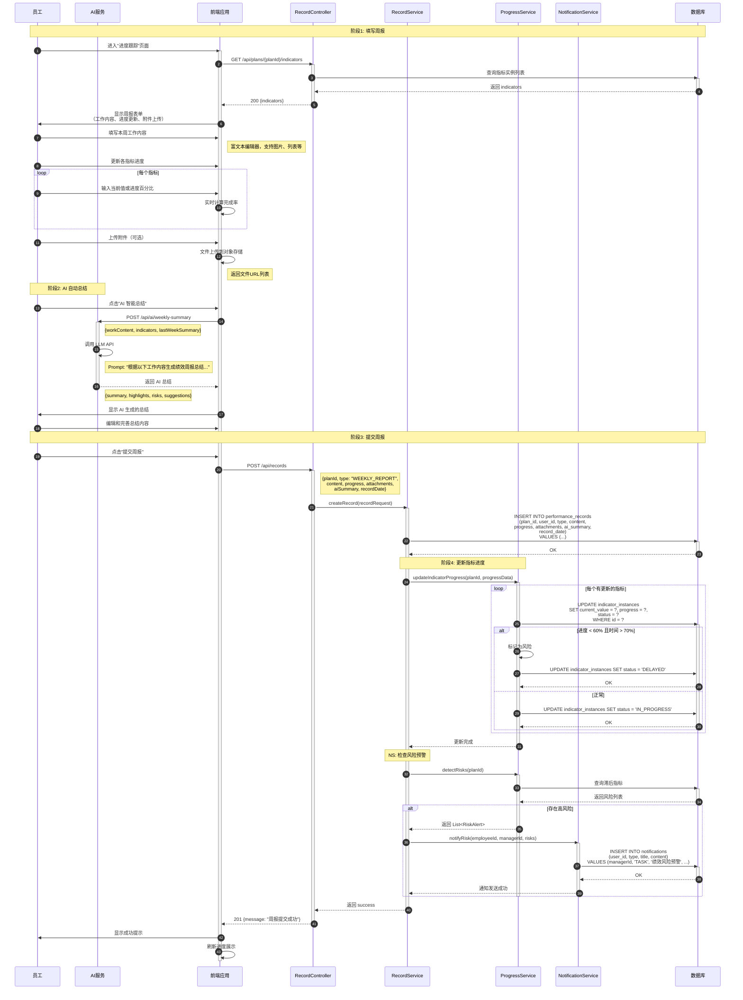
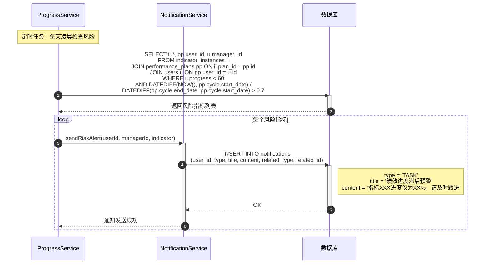

# 进度跟踪流程序列图

## 📋 业务场景

描述员工填报周报、更新指标进度、AI自动总结、风险预警的完整流程。

## 👥 参与者定义

| 参与者 | 缩写 | 说明 |
|--------|------|------|
| 员工 | Employee | 填报人 |
| AI服务 | AIService | LLM 智能总结 |
| 前端应用 | FE | React 前端应用 |
| 记录控制器 | RecordController | API 端点 |
| 记录服务 | RecordService | 记录业务逻辑 |
| 进度服务 | ProgressService | 进度计算和预警 |
| 通知服务 | NotificationService | 发送预警通知 |
| 数据库 | DB | MySQL |

---

## 🔄 主流程：填报周报并更新进度



---

## 🔀 异常流程：风险预警触发



---

## 💡 技术实现要点

### AI 总结服务

```java
@Service
public class AISummaryService {
    
    @Autowired
    private OpenAiClient openAiClient;
    
    public WeeklySummary generateSummary(String workContent, List<Indicator> indicators) {
        String prompt = buildPrompt(workContent, indicators);
        
        ChatCompletionRequest request = ChatCompletionRequest.builder()
                .model("gpt-4")
                .messages(List.of(
                    new ChatMessage("system", "你是专业的绩效管理助手"),
                    new ChatMessage("user", prompt)
                ))
                .temperature(0.7)
                .maxTokens(500)
                .build();
        
        ChatCompletionResult result = openAiClient.createChatCompletion(request);
        String summary = result.getChoices().get(0).getMessage().getContent();
        
        return parseSummary(summary);
    }
}
```

### 风险检测服务

```java
@Service
public class RiskDetectionService {
    
    public List<RiskAlert> detectRisks(Long planId) {
        PerformancePlan plan = planRepository.findById(planId).orElseThrow();
        LocalDate today = LocalDate.now();
        
        // 计算周期进度
        long totalDays = ChronoUnit.DAYS.between(plan.getCycle().getStartDate(), 
                                                  plan.getCycle().getEndDate());
        long elapsedDays = ChronoUnit.DAYS.between(plan.getCycle().getStartDate(), today);
        double timeProgress = (double) elapsedDays / totalDays;
        
        List<IndicatorInstance> instances = instanceRepository.findByPlanId(planId);
        List<RiskAlert> risks = new ArrayList<>();
        
        for (IndicatorInstance instance : instances) {
            double indicatorProgress = instance.getProgress().doubleValue() / 100;
            
            // 风险判定：进度滞后超过20%
            if (timeProgress - indicatorProgress > 0.2) {
                risks.add(new RiskAlert(
                    instance.getId(),
                    instance.getName(),
                    instance.getProgress(),
                    RiskLevel.HIGH,
                    String.format("进度滞后%.1f%%", (timeProgress - indicatorProgress) * 100)
                ));
            }
        }
        
        return risks;
    }
}
```

---

## 🔗 相关文档

- [API 接口设计 - 进度跟踪](../../api/api-design.md#8-进度跟踪接口)
- [领域模型设计 - PerformanceRecord](../domain-model-detail.md#36-performancerecord绩效记录)

---

**文档版本**: V1.0  
**最后更新**: 2026-04-14  
**维护者**: 架构团队
