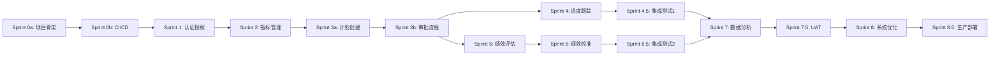

# 项目开发执行计划书：企业绩效考核系统

**版本**: V2.0  
**创建日期**: 2026-04-14  
**最后更新**: 2026-04-14  
**基于设计文档**: 
- [系统架构设计](./architecture/system-architecture.md)
- [领域模型设计](./architecture/domain-model-detail.md)
- [API 接口设计](./api/api-design.md)
- [数据库设计](./database/schema-design.md)
- [交互序列图](./architecture/sequences/README.md)
- [测试规范](./tests/testing-strategy.md)

**目标**: 将系统蓝图转化为可交付、可测试、分阶段迭代的产品。

---

## 📋 一、开发方法论与标准流程

### 1.1 核心开发流程

每个功能模块必须严格遵循以下流程：

```
需求分析 → 功能拆解 → 技术方案 → API 设计 → 数据库设计 → 
后端开发 → 前端开发 → 单元测试 → 集成测试 → E2E 测试 → 
Code Review → Sprint Review → 风险评估
```

### 1.2 质量门禁标准

| 检查项 | 标准 | 工具 |
|--------|------|------|
| 代码覆盖率 | ≥ 70%（Service 层 ≥ 85%） | Jacoco / Vitest |
| 单元测试通过率 | 100% | JUnit 5 / Vitest |
| 集成测试通过率 | 100% | Spring Boot Test |
| 代码规范 | 0 个 Blocker/Critical | SonarQube / ESLint |
| Code Review | ≥ 2 人通过 | GitHub PR |
| API 文档同步 | 100% 覆盖 | Swagger / OpenAPI |

### 1.3 分支管理策略

- **main**: 生产环境代码（受保护）
- **develop**: 开发主分支
- **feature/xxx**: 功能分支（从 develop 切出）
- **hotfix/xxx**: 紧急修复分支（从 main 切出）

**合并规则**：
- Feature 分支 → Develop：需要 CI 通过 + 2 人 Review
- Develop → Main：需要 Sprint Review + UAT 通过

---

## 📅 二、总览与里程碑划分

本项目开发周期预计为 **19.5 周**（约 5 个月），采用敏捷开发模式，每 2 周一个 Sprint。严格按照"增量交付、核心功能优先"的原则进行。

### 2.1 Sprint 规划总览

| Sprint | 周期 | 核心主题 | 关键交付物 | 验收标准 | 风险等级 |
|--------|------|---------|-----------|---------|----------|
| **Sprint 0a** | 第 1 周 (前半) | 项目骨架搭建 | 前后端空项目、基础依赖、Docker Compose | 可编译运行、容器启动 | P2 |
| **Sprint 0b** | 第 1 周 (后半) | CI/CD + 数据库迁移 | GitHub Actions、Flyway 配置、测试框架 | 自动化构建、数据库自动迁移 | P2 |
| **Sprint 1** | 第 2-3 周 | 认证授权与组织架构 | 登录/登出、RBAC、组织树 | 用户可登录、权限拦截有效 | P1 |
| **Sprint 2** | 第 4-5 周 | 绩效周期与指标管理 | 周期 CRUD、指标库、权重配置 | 指标可创建、权重校验通过 | P1 |
| **Sprint 3a** | 第 6-7 周 | 绩效计划创建 ⭐ | 计划向导、草稿保存、权重校验 | 计划可创建、草稿可保存 | **P0** |
| **Sprint 3b** | 第 8 周 | 审批流程与状态机 ⭐ | 提交审批、主管审批、状态流转 | 完整闭环：创建→提交→审批 | **P0** |
| **Sprint 4** | 第 9-10 周 | 进度跟踪与周报 | 周报表单、AI 总结、风险预警 | 周报可提交、AI 总结可用 | P1 |
| **Sprint 4.5** | 第 10.5 周 | 集成测试（阶段一） | 端到端流程测试、性能基准测试 | 核心流程 E2E 测试通过 | P1 |
| **Sprint 5** | 第 11-13 周 | 绩效评估与评分 ⭐ | 自评、上级评、分数计算 | 评分准确、事务一致 | **P0** |
| **Sprint 6** | 第 14-15 周 | 绩效校准与强制分布 | 校准工作台、拖拽调整、分布校验 | 强制分布规则生效 | P1 |
| **Sprint 6.5** | 第 15.5 周 | 集成测试（阶段二） | 完整业务流程测试、回归测试 | 所有模块集成测试通过 | P1 |
| **Sprint 7** | 第 16-17 周 | 数据分析与看板 | 概览卡片、图表、缓存优化 | 大数据量查询 < 2s | P1 |
| **Sprint 7.5** | 第 17.5 周 | UAT 用户验收测试 | 真实用户场景测试、反馈收集 | UAT 通过率 ≥ 95% | P1 |
| **Sprint 8** | 第 18-19 周 | 系统优化与上线准备 | 性能优化、安全加固、文档完善 | 性能测试报告、运维手册 | P2 |
| **Sprint 8.5** | 第 19.5 周 | 生产环境部署 | 生产环境配置、监控告警、灰度发布 | 系统稳定运行 24 小时 | P0 |

### 2.2 关键依赖关系



**说明**：
- **Sprint 0a/0b**：基础设施分两阶段，降低初期风险
- **Sprint 3a/3b**：核心功能拆分，确保计划创建质量
- **Sprint 4.5/6.5**：集成测试周，提前发现集成问题
- **Sprint 7.5**：UAT 用户验收测试，确保符合业务需求
- **Sprint 8.5**：生产部署缓冲，确保平稳上线

---

## 🏗️ 三、详细开发任务分解

### Sprint 0: 基础设施准备（第 1 周）

**目标**：搭建完整的开发环境和基础框架

#### 任务 0.1: 项目初始化

**需求**：
- 前后端项目骨架搭建
- 基础依赖配置
- 开发环境统一

**技术方案**：
- 后端：Spring Boot 3.5.0 + JDK 21 + Maven
- 前端：React 18 + TypeScript 5 + Vite 6
- 数据库：MySQL 8.0 + Redis 7.x

**开发步骤**：
1. [ ] 初始化后端项目结构（参考 tech-stack.md）
2. [ ] 初始化前端项目结构
3. [ ] 配置 Docker Compose（MySQL + Redis）
4. [ ] 配置 IDE 代码格式化（Spotless + Prettier）

**测试**：
- [ ] 项目可成功编译
- [ ] Docker 容器可正常启动

**验收标准**：
- ✅ `mvn clean install` 成功
- ✅ `npm run build` 成功
- ✅ `docker-compose up` 启动所有服务

---

#### 任务 0.2: CI/CD 流水线配置

**需求**：自动化构建、测试、部署

**技术方案**：
- GitHub Actions 工作流
- Maven Surefire/Failsafe 插件
- Vitest 测试框架
- Codecov 覆盖率上报

**开发步骤**：
1. [ ] 配置 `.github/workflows/ci.yml`
2. [ ] 配置 Maven 测试插件（参考 ci-cd-integration.md）
3. [ ] 配置前端测试流程
4. [ ] 集成 SonarQube 代码质量扫描

**测试**：
- [ ] Push 代码触发 CI
- [ ] 测试失败阻止合并

**验收标准**：
- ✅ CI 流水线自动执行
- ✅ 测试报告生成
- ✅ 覆盖率上报成功

---

#### 任务 0.3: 数据库迁移配置

**需求**：Flyway 数据库版本管理

**技术方案**：
- Flyway 10.x
- 脚本命名规范：`V{version}__{description}.sql`

**开发步骤**：
1. [ ] 配置 Flyway（application.yml）
2. [ ] 创建初始脚本 `V1__init_schema.sql`
3. [ ] 配置测试环境 H2 数据库

**测试**：
- [ ] 应用启动自动执行迁移
- [ ] 回滚机制验证

**验收标准**：
- ✅ 数据库表自动创建
- ✅ 版本记录表 `flyway_schema_history` 存在

---

**Sprint 0 交付物**：
- ✅ 可运行的空项目
- ✅ CI/CD 自动化流水线
- ✅ 数据库迁移配置
- ✅ 开发规范文档

---

### Sprint 1: 认证授权与组织架构（第 2-3 周）

**对应设计文档**：
- [auth-sequence.md](./architecture/sequences/auth-sequence.md) - 认证流程
- [security-design.md](./architecture/security-design.md) - 安全设计
- [schema-design.md](./database/schema-design.md#22-用户管理模块) - 数据库表

**目标**：实现用户认证、授权和组织管理

#### 任务 1.1: 用户认证（登录/登出）

**需求**：
- 用户名密码登录
- JWT Token 生成和验证
- Refresh Token 机制
- 退出登录

**API 设计**（参考 api-design.md 第 2 章）：
```http
POST /api/v1/auth/login
POST /api/v1/auth/refresh
POST /api/v1/auth/logout
GET  /api/v1/auth/me
```

**数据库设计**：
- `users` 表（已存在）
- Redis: `refresh_token:{userId}:{token}`

**开发步骤**：
1. [ ] 创建 `User` 实体和 Repository
2. [ ] 实现 `AuthService`（参考 auth-sequence.md）
3. [ ] 实现 `JwtUtil` 工具类
4. [ ] 实现 `AuthController`
5. [ ] 配置 Spring Security + JWT 过滤器
6. [ ] 前端登录页面开发
7. [ ] Axios 拦截器（自动携带 Token）

**测试**：
- [ ] 单元测试：`AuthServiceTest`（Mockito）
- [ ] 集成测试：`AuthControllerIntegrationTest`（MockMvc）
- [ ] 异常场景：密码错误、账号锁定、Token 过期
- [ ] E2E 测试：完整登录流程

**验收标准**：
- ✅ 登录成功返回 Access Token + Refresh Token
- ✅ Token 刷新正常工作
- ✅ 退出登录后 Token 失效
- ✅ 未认证请求被拦截（401）

**风险评估**：
- ⚠️ Token 安全性：使用 HttpOnly Cookie 存储 Refresh Token
- ⚠️ 并发登录：限制同一账号最多 3 个设备

---

#### 任务 1.2: RBAC 权限控制

**需求**：
- 基于角色的访问控制
- 功能权限（菜单、按钮）
- 数据权限（部门隔离）

**API 设计**：
```http
GET  /api/v1/roles
GET  /api/v1/permissions
POST /api/v1/users/{id}/roles
```

**数据库设计**：
- `roles` 表
- `permissions` 表
- `user_roles` 关联表
- `role_permissions` 关联表

**开发步骤**：
1. [ ] 创建 Role、Permission 实体
2. [ ] 实现权限加载服务
3. [ ] 配置方法级权限注解（@PreAuthorize）
4. [ ] 前端权限指令（v-permission）

**测试**：
- [ ] 不同角色访问权限验证
- [ ] 数据权限隔离测试

**验收标准**：
- ✅ 无权限访问返回 403
- ✅ 数据按部门隔离

---

#### 任务 1.3: 组织树管理

**需求**：
- 组织层级结构
- 组织 CRUD
- 组织树查询

**API 设计**：
```http
GET  /api/v1/orgs/tree
POST /api/v1/orgs
PUT  /api/v1/orgs/{id}
DELETE /api/v1/orgs/{id}
```

**开发步骤**：
1. [ ] 创建 `Org` 实体（自关联）
2. [ ] 实现组织树递归查询
3. [ ] 前端组织树组件（Ant Design Tree）

**测试**：
- [ ] 多层级组织树查询
- [ ] 删除组织时子组织处理

**验收标准**：
- ✅ 组织树正确展示
- ✅ 级联删除或转移子组织

---

**Sprint 1 交付物**：
- ✅ 用户登录/登出功能
- ✅ JWT Token 管理
- ✅ RBAC 权限控制
- ✅ 组织树管理

---

### Sprint 2: 绩效周期与指标管理（第 4-5 周）

**对应设计文档**：
- [domain-model-detail.md](./architecture/domain-model-detail.md#32-performancecycle绩效周期)
- [api-design.md](./api/api-design.md#5-绩效周期接口)

**目标**：实现绩效周期管理和指标库

#### 任务 2.1: 绩效周期管理

**需求**：
- 周期 CRUD（季度/年度/月度）
- 周期状态流转（DRAFT → IN_PROGRESS → ENDED）
- 周期时间校验

**API 设计**：
```http
GET  /api/v1/cycles
POST /api/v1/cycles
PUT  /api/v1/cycles/{id}
POST /api/v1/cycles/{id}/start
POST /api/v1/cycles/{id}/end
```

**开发步骤**：
1. [ ] 创建 `PerformanceCycle` 实体
2. [ ] 实现周期状态机
3. [ ] 周期时间冲突检测
4. [ ] 前端周期管理页面

**测试**：
- [ ] 状态流转测试
- [ ] 时间冲突检测

**验收标准**：
- ✅ 周期状态正确流转
- ✅ 不允许时间重叠的周期

---

#### 任务 2.2: 指标库管理

**需求**：
- 指标 CRUD
- 指标分类（KPI/OKR）
- 指标启用/禁用
- 指标模板

**API 设计**：
```http
GET  /api/v1/indicators
POST /api/v1/indicators
PUT  /api/v1/indicators/{id}
DELETE /api/v1/indicators/{id}
POST /api/v1/indicators/{id}/enable
```

**数据库设计**：
- `indicators` 表
- `indicator_categories` 表

**开发步骤**：
1. [ ] 创建 `Indicator` 实体
2. [ ] 实现指标分类管理
3. [ ] 指标搜索和筛选
4. [ ] 前端指标库页面

**测试**：
- [ ] 指标 CRUD 测试
- [ ] 分类筛选测试

**验收标准**：
- ✅ 指标可按类型筛选
- ✅ 禁用的指标不可选择

---

#### 任务 2.3: 权重配置与校验

**需求**：
- 指标权重配置（0-100%）
- 权重总和校验（必须=100%）

**技术方案**：
- 后端：`WeightValidator` 组件
- 前端：实时校验提示

**开发步骤**：
1. [ ] 实现 `WeightValidator`（参考 backend-testing-guide.md）
2. [ ] 前端权重输入组件（带实时校验）
3. [ ] 权重总和显示

**测试**：
- [ ] 权重总和 != 100% 时拒绝提交
- [ ] 边界值测试（0%、100%、小数）

**验收标准**：
- ✅ 权重总和必须为 100%
- ✅ 前端实时提示

---

**Sprint 2 交付物**：
- ✅ 绩效周期管理
- ✅ 指标库管理
- ✅ 权重配置与校验

---

### Sprint 3: 绩效计划创建与审批（第 6-8 周）⭐ 核心

**对应设计文档**：
- [plan-create-sequence.md](./architecture/sequences/plan-create-sequence.md)
- [plan-approval-sequence.md](./architecture/sequences/plan-approval-sequence.md)
- [domain-model-detail.md](./architecture/domain-model-detail.md#34-performanceplan绩效计划)

**目标**：实现绩效计划的完整生命周期

#### 任务 3.1: 绩效计划创建向导

**需求**：
- 选择绩效周期
- 从指标库选择指标
- 设置目标值和权重
- 保存草稿
- 提交审批

**API 设计**：
```http
GET  /api/v1/plans?cycleId={id}
POST /api/v1/plans
PUT  /api/v1/plans/{id}
POST /api/v1/plans/{id}/submit
```

**开发步骤**：
1. [ ] 创建 `PerformancePlan` 和 `IndicatorInstance` 实体
2. [ ] 实现计划创建 Service（参考 plan-create-sequence.md）
3. [ ] 实现权重校验逻辑
4. [ ] 实现草稿保存
5. [ ] 前端向导组件（Steps）
6. [ ] 指标选择器（支持搜索、多选）
7. [ ] 权重实时校验

**测试**：
- [ ] 单元测试：`PlanServiceTest`
- [ ] 集成测试：`PlanControllerIntegrationTest`
- [ ] 异常场景：指标不存在、权重不合法
- [ ] 并发测试：重复提交

**验收标准**：
- ✅ 计划创建成功
- ✅ 权重校验生效
- ✅ 草稿可保存和恢复
- ✅ 提交后状态变更为 PENDING_APPROVE

**风险评估**：
- ⚠️ **P0**: 权重校验必须在后端再次验证（防止前端绕过）
- ⚠️ **P0**: 使用行级锁防止并发提交

---

#### 任务 3.2: 审批流程

**需求**：
- 主管查看待审批列表
- 审批通过/驳回
- 填写审批意见
- 通知员工

**API 设计**：
```http
GET  /api/v1/plans?status=PENDING_APPROVE&managerId={id}
POST /api/v1/plans/{id}/approve
```

**开发步骤**：
1. [ ] 实现审批 Service（参考 plan-approval-sequence.md）
2. [ ] 实现通知服务（异步）
3. [ ] 前端待审批列表页面
4. [ ] 审批对话框

**测试**：
- [ ] 审批通过流程
- [ ] 审批驳回流程
- [ ] 通知发送测试

**验收标准**：
- ✅ 审批通过后状态变为 IN_PROGRESS
- ✅ 审批驳回后状态回到 DRAFT
- ✅ 员工收到通知

---

#### 任务 3.3: 状态机实现

**需求**：
- 严格控制计划状态流转
- 防止非法状态变更

**状态流转图**：
```
DRAFT → PENDING_SUBMIT → PENDING_APPROVE → IN_PROGRESS → 
PENDING_EVAL → EVALUATED → CALIBRATED → ARCHIVED
```

**开发步骤**：
1. [ ] 实现 `PlanStateMachine` 服务
2. [ ] 定义状态转换规则
3. [ ] 所有状态变更必须通过状态机

**测试**：
- [ ] 所有合法状态转换
- [ ] 非法状态转换被拒绝

**验收标准**：
- ✅ 状态流转符合设计
- ✅ 非法操作抛出异常

---

**Sprint 3 交付物**：
- ✅ 绩效计划创建向导
- ✅ 草稿保存功能
- ✅ 审批流程
- ✅ 状态机控制

---

### Sprint 4: 进度跟踪与周报（第 9-10 周）

**对应设计文档**：
- [progress-tracking-sequence.md](./architecture/sequences/progress-tracking-sequence.md)

**目标**：实现进度记录和智能总结

#### 任务 4.1: 周报表单

**需求**：
- 富文本编辑器
- 附件上传
- 进度更新
- AI 智能总结

**API 设计**：
```http
POST /api/v1/records
GET  /api/v1/records?planId={id}&type=WEEKLY
POST /api/v1/ai/weekly-summary
```

**开发步骤**：
1. [ ] 创建 `PerformanceRecord` 实体
2. [ ] 实现记录 Service
3. [ ] 集成富文本编辑器（Quill/TinyMCE）
4. [ ] 文件上传到对象存储（MinIO/OSS）
5. [ ] 前端周报表单

**测试**：
- [ ] 记录提交测试
- [ ] 文件上传测试

**验收标准**：
- ✅ 周报可提交
- ✅ 附件可上传和下载

---

#### 任务 4.2: AI 智能总结

**需求**：
- 调用 LLM API 生成周报总结
- 提取关键成果
- 识别风险点

**技术方案**：
- OpenAI GPT-4 / 国内大模型
- Prompt 工程优化

**开发步骤**：
1. [ ] 配置 AI 服务（API Key）
2. [ ] 实现 `AISummaryService`
3. [ ] Prompt 模板设计
4. [ ] 前端"AI 总结"按钮

**测试**：
- [ ] AI 总结质量评估
- [ ] API 超时处理

**验收标准**：
- ✅ AI 总结在 3 秒内返回
- ✅ 总结内容结构化

---

#### 任务 4.3: 风险预警

**需求**：
- 进度滞后检测
- 自动发送预警通知
- 定时任务

**开发步骤**：
1. [ ] 实现 `RiskDetectionService`
2. [ ] 配置定时任务（每天凌晨）
3. [ ] 预警通知发送
4. [ ] 前端风险标识

**测试**：
- [ ] 风险计算准确性
- [ ] 定时任务执行

**验收标准**：
- ✅ 滞后指标被标记
- ✅ 主管收到预警通知

---

**Sprint 4 交付物**：
- ✅ 周报表单
- ✅ AI 智能总结
- ✅ 风险预警

---

### Sprint 5: 绩效评估与评分（第 11-13 周）⭐ 核心

**对应设计文档**：
- [evaluation-sequence.md](./architecture/sequences/evaluation-sequence.md)
- [domain-model-detail.md](./architecture/domain-model-detail.md#37-score评分)

**目标**：实现多维度评分和分数计算

#### 任务 5.1: 自评和上级评

**需求**：
- 员工自评
- 上级评分
- 评分维度配置
- 评语填写

**API 设计**：
```http
POST /api/v1/scores
GET  /api/v1/scores/pending?evaluatorId={id}
```

**开发步骤**：
1. [ ] 创建 `Score` 实体
2. [ ] 实现评分 Service（参考 evaluation-sequence.md）
3. [ ] 前端评分表单
4. [ ] 自评和上级评入口

**测试**：
- [ ] 评分提交测试
- [ ] 重复评分拦截

**验收标准**：
- ✅ 评分可提交
- ✅ 不允许重复评分

---

#### 任务 5.2: 分数计算引擎

**需求**：
- 加权平均分计算
- 绩效等级判定（A/B/C/D）
- 事务一致性

**技术方案**：
- `ScoreCalculationEngine` 组件
- 事务控制（@Transactional）

**开发步骤**：
1. [ ] 实现 `ScoreCalculationEngine`
2. [ ] 等级映射配置（level_mappings 表）
3. [ ] 所有评分完成后自动计算总分

**测试**：
- [ ] 分数计算准确性（边界值）
- [ ] 事务回滚测试

**验收标准**：
- ✅ 总分计算准确
- ✅ 等级判定正确
- ✅ 事务一致性保证

---

**Sprint 5 交付物**：
- ✅ 自评和上级评
- ✅ 分数计算引擎
- ✅ 绩效等级判定

---

### Sprint 6: 绩效校准与强制分布（第 14-15 周）

**对应设计文档**：
- [calibration-sequence.md](./architecture/sequences/calibration-sequence.md)

**目标**：实现 HR 校准和强制分布控制

#### 任务 6.1: 校准工作台

**需求**：
- 查看部门绩效分布
- 拖拽调整等级
- 填写校准原因

**API 设计**：
```http
GET  /api/v1/calibrations?cycleId={id}&orgId={id}
POST /api/v1/calibrations
```

**开发步骤**：
1. [ ] 创建 `Calibration` 实体
2. [ ] 实现 `DistributionChecker`
3. [ ] 前端拖拽组件（react-beautiful-dnd）
4. [ ] 实时分布计算

**测试**：
- [ ] 强制分布校验
- [ ] 批量调整测试

**验收标准**：
- ✅ 拖拽调整流畅
- ✅ 分布不符合时禁止提交

---

**Sprint 6 交付物**：
- ✅ 校准工作台
- ✅ 强制分布控制

---

### Sprint 7: 数据分析与看板（第 16-17 周）

**对应设计文档**：
- [dashboard-query-sequence.md](./architecture/sequences/dashboard-query-sequence.md)

**目标**：实现数据可视化和性能优化

#### 任务 7.1: 绩效看板

**需求**：
- 概览卡片（总人数、平均分、分布）
- 等级分布饼图
- 部门排名柱状图
- 趋势折线图

**API 设计**：
```http
GET /api/v1/dashboard/overview?cycleId={id}&orgId={id}
GET /api/v1/dashboard/dept-ranking?cycleId={id}
GET /api/v1/dashboard/trend?userId={id}
```

**开发步骤**：
1. [ ] 实现聚合查询 SQL
2. [ ] Redis 缓存（TTL 1 小时）
3. [ ] 前端 ECharts 图表
4. [ ] 筛选器（周期、部门）

**测试**：
- [ ] 大数据量性能测试（>10万条）
- [ ] 缓存命中率测试

**验收标准**：
- ✅ 查询响应时间 < 2s
- ✅ 缓存命中率 > 80%

---

**Sprint 7 交付物**：
- ✅ 绩效看板
- ✅ 图表可视化
- ✅ 缓存优化

---

### Sprint 8: 系统优化与上线准备（第 18 周）

**目标**：全面优化和准备生产环境

#### 任务 8.1: 性能优化

**开发步骤**：
1. [ ] SQL 索引优化
2. [ ] N+1 查询问题修复
3. [ ] 前端代码分割
4. [ ] 图片懒加载

**测试**：
- [ ] 压力测试（JMeter）
- [ ] 前端性能审计（Lighthouse）

**验收标准**：
- ✅ API P95 响应时间 < 500ms
- ✅ 前端 Lighthouse 评分 > 90

---

#### 任务 8.2: 安全加固

**开发步骤**：
1. [ ] HTTPS 配置
2. [ ] CORS 白名单
3. [ ] API 限流（Redis + Lua）
4. [ ] SQL 注入防护验证
5. [ ] XSS 防护验证

**测试**：
- [ ] 安全扫描（OWASP ZAP）
- [ ] 渗透测试

**验收标准**：
- ✅ 无高危安全漏洞

---

#### 任务 8.3: 文档完善

**开发步骤**：
1. [ ] 编写运维手册
2. [ ] 编写用户手册
3. [ ] API 文档最终版
4. [ ] 数据库字典

**验收标准**：
- ✅ 所有文档齐全

---

**Sprint 8 交付物**：
- ✅ 性能优化报告
- ✅ 安全审计报告
- ✅ 运维手册
- ✅ 用户手册

---

## ⚠️ 四、风险控制与回滚方案

### 4.1 技术风险

| 风险点 | 等级 | 影响范围 | 预案/回滚方案 |
| :--- | :--- | :--- | :--- |
| **数据一致性** | P0 | 核心数据（指标权重，最终得分） | **必须**在数据库层设计事务，关键变更必须记录前版本数据，并在回滚脚本中提供补偿机制。 |
| **流程控制** | P0 | 流程状态错乱 | **强制**使用状态机，任何修改都必须通过后端状态校验层。 |
| **并发问题** | P0 | 计划提交、评分操作 | 使用行级锁（SELECT FOR UPDATE）或乐观锁（version 字段）。 |
| **性能瓶颈** | P1 | 大数据量查询 | 早期引入 Redis 缓存，SQL 索引优化，必要时使用 ClickHouse。 |
| **第三方依赖** | P1 | AI 服务、对象存储 | 抽象接口层，提供 Mock 实现，便于切换供应商。 |

### 4.2 业务风险

| 风险点 | 等级 | 影响范围 | 预案/回滚方案 |
| :--- | :--- | :--- | :--- |
| **需求变更** | P1 | 开发进度延迟 | 采用敏捷迭代，每 2 周评审，优先级动态调整。 |
| **用户接受度** | P2 | 系统推广困难 | 早期用户参与 UAT，收集反馈快速迭代。 |
| **数据迁移** | P1 | 历史数据兼容 | 每次数据字段变更，必须提供一条**兼容历史数据的升级脚本**。 |

### 4.3 回滚策略

**数据库回滚**：
- Flyway 提供回滚脚本（undo migrations）
- 关键操作前备份数据快照

**代码回滚**：
- Git Tag 标记每个发布版本
- 快速回滚到上一个稳定版本

**功能开关**：
- 新功能使用 Feature Flag 控制
- 出现问题时可快速关闭功能

---

## ✅ 五、开发及测试标准检查清单

### 5.1 开发人员自查清单

**开发人员在完成任何代码模块时，必须检查以下事项并提交至PR：**

#### 代码质量
- [ ] 所有新API和业务逻辑都遵循【分层架构】（Controller → Service → Repository）
- [ ] 所有数据操作都通过相应的 `infra/` 抽象层
- [ ] 业务流程的每一步（状态变更）都通过**状态机**控制
- [ ] 代码符合规范（Spotless apply / Prettier format）
- [ ] 无硬编码（使用配置文件或常量）
- [ ] 添加必要的注释（JavaDoc、复杂逻辑说明）

#### 测试覆盖
- [ ] 针对新功能点，必须新增 **单元测试**（覆盖率 ≥ 70%）
- [ ] 关键业务逻辑必须有 **集成测试**
- [ ] 核心流程必须有 **E2E 测试**
- [ ] 异常场景已覆盖（空值、边界值、并发）

#### 文档同步
- [ ] API 变更已更新 Swagger/OpenAPI 文档
- [ ] 数据库变更已添加 Flyway 迁移脚本
- [ ] 复杂逻辑已更新相关设计文档

#### 提交规范
- [ ] **每次提交** 必须包含详细的修改原因、影响范围和风险等级
- [ ] Commit Message 符合规范（feat/fix/docs/style/refactor/test/chore）
- [ ] PR 描述清晰，包含测试截图或视频

---

### 5.2 Code Review 检查清单

**Reviewer 必须检查以下事项：**

#### 架构合规
- [ ] 是否符合分层架构原则？
- [ ] 是否有循环依赖？
- [ ] 是否正确使用设计模式？

#### 代码质量
- [ ] 代码是否简洁易读？
- [ ] 是否有重复代码（DRY 原则）？
- [ ] 变量命名是否清晰？
- [ ] 方法是否过长（> 50 行需重构）？

#### 安全性
- [ ] 是否有 SQL 注入风险？
- [ ] 是否有 XSS 风险？
- [ ] 敏感信息是否加密？
- [ ] 权限校验是否完整？

#### 性能
- [ ] 是否有 N+1 查询问题？
- [ ] 是否合理使用缓存？
- [ ] 是否有内存泄漏风险？

#### 测试
- [ ] 单元测试是否充分？
- [ ] 是否覆盖了异常场景？
- [ ] 测试命名是否清晰？

**至少需要 2 人 Review 通过才能合并。**

---

### 5.3 Sprint Review 检查清单

**每个 Sprint 结束时必须进行 Review：**

- [ ] 所有计划的功能已完成
- [ ] 所有测试通过（单元、集成、E2E）
- [ ] 代码覆盖率达标（≥ 70%）
- [ ] 无 Blocker/Critical 级别 Bug
- [ ] 文档已更新
- [ ] Demo 演示通过
- [ ] 风险评估完成

---

## 📊 六、进度跟踪与报告

### 6.1 每日站会（Daily Standup）

**时间**：每天上午 10:00，15 分钟  
**内容**：
- 昨天完成了什么？
- 今天计划做什么？
- 遇到什么阻碍？

### 6.2 Sprint 评审（Sprint Review）

**时间**：每 2 周最后一个周五下午  
**参与人员**：全体开发团队、产品经理、利益相关者  
**内容**：
- Demo 演示已完成功能
- 收集反馈
- 调整下一个 Sprint 计划

### 6.3  retrospectives（回顾会议）

**时间**：Sprint Review 之后  
**内容**：
- 哪些做得好？
- 哪些需要改进？
- 行动计划是什么？

### 6.4 进度报告模板

**每周向项目负责人报告**：

```markdown
## 周报 - [日期]

### 本周完成
- [功能1] 100%
- [功能2] 80%

### 下周计划
- [功能3]
- [功能4]

### 风险与问题
- [风险1] - 缓解措施：...
- [问题1] - 需要支持：...

### 关键指标
- 代码覆盖率：XX%
- Bug 数量：XX
- 燃尽图：[链接]
```

---

## 📚 七、参考文档索引

### 架构设计
- [系统架构设计](./architecture/system-architecture.md)
- [领域模型设计](./architecture/domain-model-detail.md)
- [技术栈详细设计](./architecture/tech-stack.md)
- [权限与安全设计](./architecture/security-design.md)

### 交互序列图
- [用户认证流程](./architecture/sequences/auth-sequence.md)
- [绩效计划创建](./architecture/sequences/plan-create-sequence.md)
- [绩效审批流程](./architecture/sequences/plan-approval-sequence.md)
- [绩效评估流程](./architecture/sequences/evaluation-sequence.md)
- [绩效校准流程](./architecture/sequences/calibration-sequence.md)
- [进度跟踪流程](./architecture/sequences/progress-tracking-sequence.md)
- [数据看板查询](./architecture/sequences/dashboard-query-sequence.md)

### 接口与数据
- [API 接口设计](./api/api-design.md)
- [数据库设计](./database/schema-design.md)

### 测试规范
- [测试策略总纲](./tests/testing-strategy.md)
- [后端测试指南](./tests/backend-testing-guide.md)
- [前端测试指南](./tests/frontend-testing-guide.md)
- [测试数据管理](./tests/test-data-management.md)
- [CI/CD 集成配置](./tests/ci-cd-integration.md)

---

**文档版本**: V2.0  
**最后更新**: 2026-04-14  
**维护者**: 技术负责人 & 项目经理  
**下次评审日期**: 每个 Sprint 结束时
